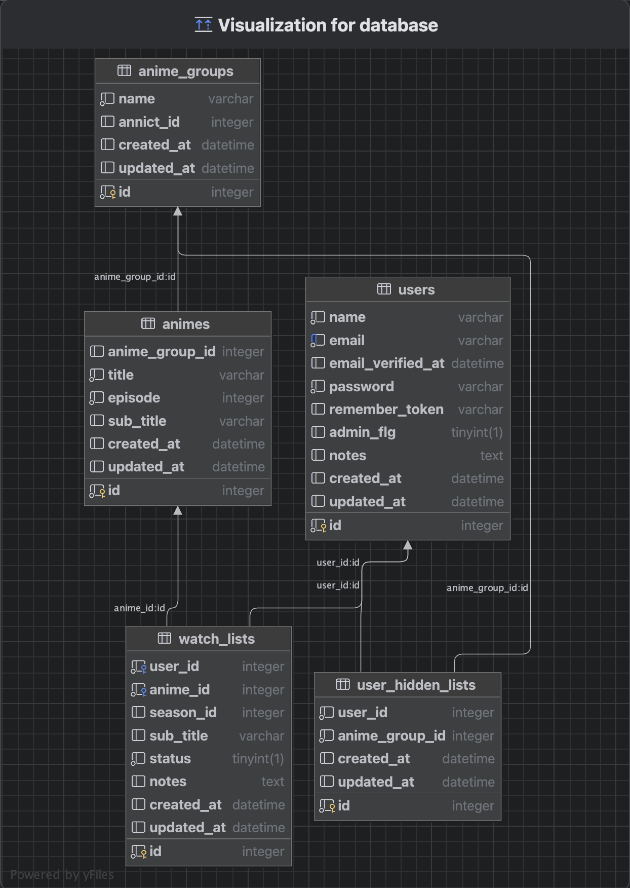
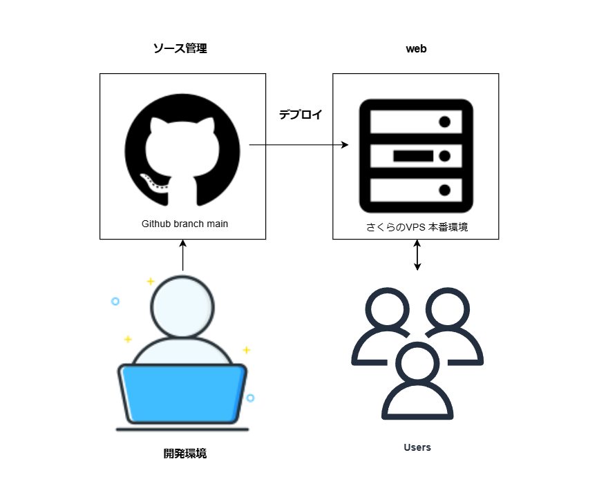

# ⭐ animalist
## プロジェクトの概要
視聴したアニメを効率的に管理し、視聴状況を簡単に確認できるツールになります。

## 制作背景
現在のアニメ業界では、多くの作品が1クール（3ヶ月）単位で放送され、その後、続編が制作されるまでに一定の期間が設けられることが多く見られます。そのため、視聴者がどのアニメのシーズンを視聴し、何話まで観たのかを簡単に管理・確認できるアプリを制作しました。

 

# ⭐ アプリ機能一覧
## 主な機能
- 権限ごとの機能制限
- APIでアニメを検索・登録
- グループごとのエピソード数を確認
- タイトルやエピソードを検索（部分・完全一致対応）
- 視聴進捗をアイコンで可視化
- メモ欄に視聴中の時間を入力可能
- 時間を削除し、「視聴済み」でアイコン変化
- 全エピソード視聴で👑アイコン表示
- ページネーション機能

 

## 仕様制限
- 全50話以下の作品に対応

## 認証機能
- ログイン機能
- ログアウト機能
- ログインID変更機能
- パスワード変更機能
- アカウント削除機能

 

# ⭐ 使用技術
## 開発環境
- VSCode
- XAMPP
- HTTPie
- Herd
- Table Plus

## プロジェクト管理
- Notion

## フロントエンド
- HTML
- CSS
- Tailwind CSS
- React.js

## バックエンド
- PHP 8.2.12
- Laravel 11.9

## 使用ライブラリー
- daisyui
- Laravel Breeze

## データベース
- MySQL

## インフラ
- さくらVPS

 

## ER図

 

## インフラ構成図

 

# ⭐ 工夫した点
- API連携によるアニメデータの取得
- 登録したアニメを話数やエピソードなどでの検索機能
- エピソードの視聴状況を✅と👀アイコンで表示
- 1つの作品で全エピソードを視聴済みの場合は👑アイコンの表示
- 視聴時間入力用のメモ欄を実装

 

# ⭐ 苦労した点
- 👑アイコンを表示させるロジックを実装
- 追加機能実装(APIデータ取得)に伴いテーブル設計を変更
- ユーザーの権限により画面を制御する実装
- UI/UXの調整でTailwind CSS、daisyUIを使用した画面レイアウトの構築

 

# ⭐ 参考にしたサービス
## 提供元サービス様：[Annict ドキュメント](https://developers.annict.com/docs)